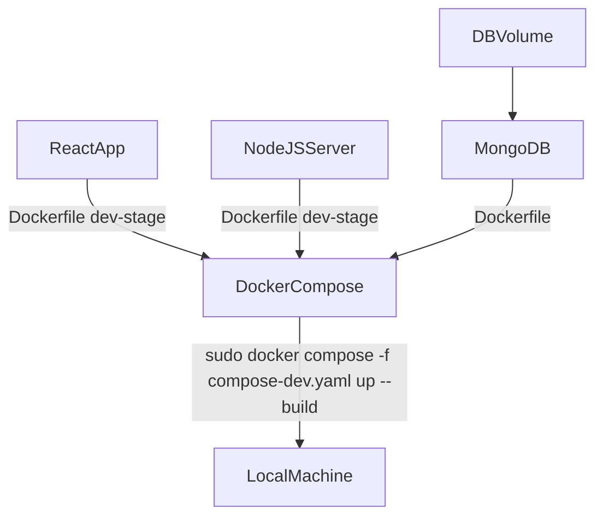
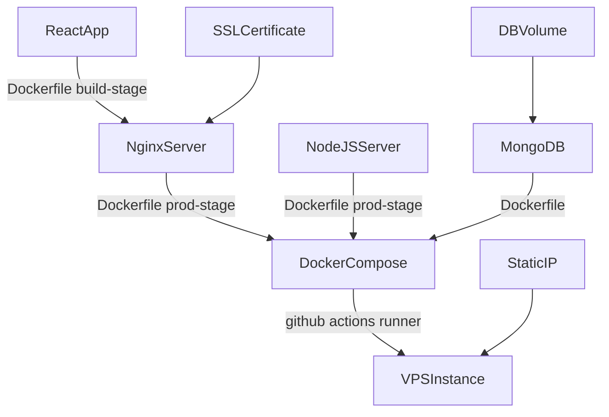

# Open Virtual Tours
Free tool for the creation of fully customizable 3D virtual tours using Three.js through React Three Fiber.

- [Open Virtual Tours](#open-virtual-tours)
  - [Features](#features)
  - [Local install](#local-install)
    - [Local requirements](#local-requirements)
    - [Local steps](#local-steps)
  - [Cloud deployment](#cloud-deployment)
    - [Cloud requirements](#cloud-requirements)
    - [Cloud steps](#cloud-steps)
  - [Troubleshooting](#troubleshooting)
    - [See your volume](#see-your-volume)
    - [Container bash](#container-bash)
    - [View error logs](#view-error-logs)


## Features
## Test online
To test the application online, head to https://openvirtualtours.org/admin and login with the following credentials:

email: superuser@email.com

password: password

## Local install
Follow these steps to run a copy of this repo on your local machine in a development environment. Work on dev branch and merge into main when you are ready to push the changes to production.

### Local requirements
- [Docker](https://docs.docker.com/engine/install/ubuntu/) and [docker-compose](https://docs.docker.com/compose/install/linux/#install-using-the-repository) installed on your local machine.
- A minimum of 8GB of disk space and 4GB of RAM.
### Local steps
1. Clone or download and extract this repo on your local machine. 
2. Navigate to the project directory and run `sudo docker compose -f compose-dev.yaml up --build`.
3. Test the application by heading to http://localhost:3000/.
4. Test the API by sending requests to http://localhost:4000/.

[](https://app.getpostman.com/run-collection/25772085-d717a68c-f457-4885-87ff-7ee63abe58e2?action=collection%2Ffork&source=rip_markdown&collection-url=entityId%3D25772085-d717a68c-f457-4885-87ff-7ee63abe58e2%26entityType%3Dcollection%26workspaceId%3D4091baf8-aab2-4ec9-9b13-9cd393ff6634#?env%5Bdev%5D=W3sia2V5IjoiYXBpX3Jvb3QiLCJ2YWx1ZSI6Imh0dHA6Ly9sb2NhbGhvc3Q6NDAwMCIsImVuYWJsZWQiOnRydWUsInR5cGUiOiJkZWZhdWx0Iiwic2Vzc2lvblZhbHVlIjoiaHR0cDovL2xvY2FsaG9zdDo0MDAwIiwic2Vzc2lvbkluZGV4IjowfV0=)

### Development environment
To enable hot-reload, install [Docker Desktop](https://docs.docker.com/desktop/install/ubuntu/) on your local machine and use the [Dev Containers](https://code.visualstudio.com/docs/devcontainers/tutorial) extension. 

## Cloud deployment
Follow these steps to generate and deploy your own fully-customizable version of the 3D virtual tour in a production environment.

### Cloud requirements
- A VPS Linux machine with a static public IP and a public DNS address.
- [Docker](https://docs.docker.com/engine/install/ubuntu/) and [docker-compose](https://docs.docker.com/compose/install/linux/#install-using-the-repository) installed on your VPS Linux machine.
- A minimum of 8GB of disk space and 4GB of RAM.

:point_right: This repo has been tested and is currently deployed on an AWS EC2 Ubuntu t2.medium instance with 8GB of disk space.

### Cloud steps
1. Fork or download and import this repo to generate a new copy under your own ownership.
2. Replace the SSL certificates in frontend/nginx/certs and the .env and frontend/.env data with your own.
3. Access the terminal of your VPS machine and create a new [self-hosted runner](https://docs.github.com/en/actions/using-github-hosted-runners/about-github-hosted-runners/about-github-hosted-runners) for your repo.

:point_right: To create a new self-hosted runner navigate to Settings &rarr; Code and automation &rarr; Actions &rarr; Runners on your repo and follow the instructions. You may need to run `sudo chmod 777 actions-runner` from the parent directory before you are allowed to run the configuration command.

:point_right: Once you're finished, run `sudo ./svc.sh install` and `sudo ./svc.sh start` to make the runner service persist on reboot.

4. Test the application by heading to the root of your public DNS address.
5. Test the API by creating your own production environment on Postman and setting api_root to your public DNS address.

[](https://app.getpostman.com/run-collection/25772085-d717a68c-f457-4885-87ff-7ee63abe58e2?action=collection%2Ffork&source=rip_markdown&collection-url=entityId%3D25772085-d717a68c-f457-4885-87ff-7ee63abe58e2%26entityType%3Dcollection%26workspaceId%3D4091baf8-aab2-4ec9-9b13-9cd393ff6634#?env%5Bprod%5D=W3sia2V5IjoiYXBpX3Jvb3RcbiIsInZhbHVlIjoiaHR0cHM6Ly9vcGVudmlydHVhbHRvdXJzLm9yZyIsImVuYWJsZWQiOnRydWUsInR5cGUiOiJkZWZhdWx0Iiwic2Vzc2lvblZhbHVlIjoiaHR0cHM6Ly9vcGVudmlydHVhbHRvdXJzLm9yZyIsInNlc3Npb25JbmRleCI6MH1d)

### Development environment
Clone your new repo on your local machine and follow the local install instructions.

## Troubleshooting
Everything should be up and running now. If you have any issues, you can see the data stored in your volume and the error logs of your containers through the following Docker commands.
### See your volume
```bash
$ sudo su
$ cd /var/lib/docker/volumes/open-virtual-tours_myvolume
```
### Container bash
```bash
$ sudo docker ps
$ sudo docker exec -it <container_id> bash
```
### View error logs
```bash
$ sudo docker ps
$ sudo docker logs <container_id>
```
