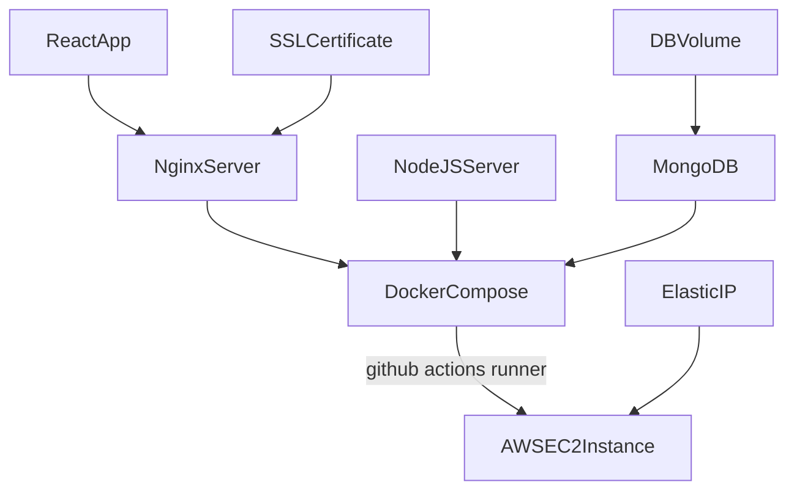

# Open Virtual Tours
Free tool for the creation of fully customizable 3D virtual tours using Three.js through React Three Fiber.

- [Open Virtual Tours](#open-virtual-tours)
  - [Features](#features)
  - [Install locally](#install-locally)
  - [Deploy to AWS](#deploy-to-aws)
    - [Check your requirements](#check-your-requirements)
    - [Access your terminal](#access-your-terminal)
    - [Install Docker and Docker Compose](#install-docker-and-docker-compose)
    - [Fork this repo](#fork-this-repo)
    - [Fill in your data](#fill-in-your-data)
    - [Clone your repo through Github Actions Runner](#clone-your-repo-through-github-actions-runner)
  - [Troubleshooting](#troubleshooting)
    - [See your volume](#see-your-volume)
    - [Container bash](#container-bash)
    - [View error logs](#view-error-logs)


## Features
## Install locally
Clone this repo and fill in all the .env file variables with your own data. Install Docker and Docker compose and run `docker compose up --build`. 
## Deploy to AWS
Here is a simple flow chart:


### Check your requirements
- Ubuntu small or higher EC2 instance with an elastic IP address.
- SSL certificate (for testing purposes, you can generate a self-signed certificate with `openssl req -x509 -newkey rsa:4096 -keyout key.pem -out cert.pem -sha256 -days 365` on your local machine).
### Access your terminal
### Install Docker and Docker Compose
On your EC2 instance, you will need to install [Docker](https://docs.docker.com/engine/install/ubuntu/) and [Docker Compose](https://docs.docker.com/compose/install/linux/#install-using-the-repository) to be able to run the containers that hold the application. Check that Docker and Docker Compose are installed correctly through `sudo docker --version` and `sudo docker compose version`.
### Fork this repo
[Fork](https://docs.github.com/en/pull-requests/collaborating-with-pull-requests/working-with-forks/fork-a-repo) this repository as yourself or your organization.
### Fill in your data
 - Include your public DNS address where needed.
 - Include your public IP address where needed.
 - Include the name of your organization, the name of your tour, description, etc. (React .env file).
 - Include your cert.pem and key.pem certificates (frontend/certs folder).
### Clone your repo through Github Actions Runner
Go to settings -> actions -> runners and create a new runner and follow the instructions. Keep in mind you need to run each installation comand as superuser and assign 777 permissions to the runner folder before the configuration step. Finally, to make the runner persist:
```bash
$ sudo ./svc.sh install
$ sudo ./svc.sh start
```
## Troubleshooting
Everything should be up and running now. If you have any issues, you can see the data stored in your volume and the error logs of your containers through the following Docker commands.
### See your volume
```bash
$ sudo su
$ cd /var/lib/docker/volumes/open-virtual-tours_myvolume
```
### Container bash
```bash
$ sudo docker ps
$ sudo docker exec -it <container_id> bash
```
### View error logs
```bash
$ sudo docker ps
$ sudo docker logs <container_id>
```
